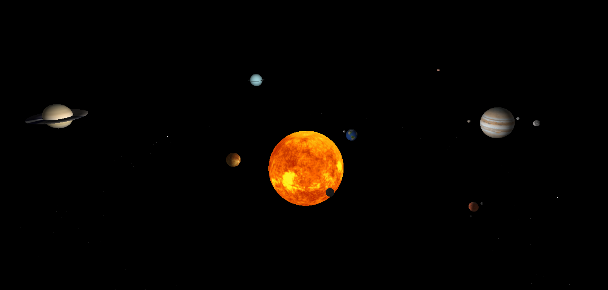
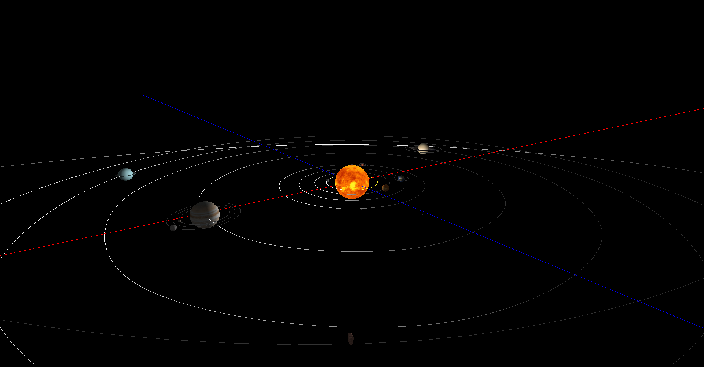
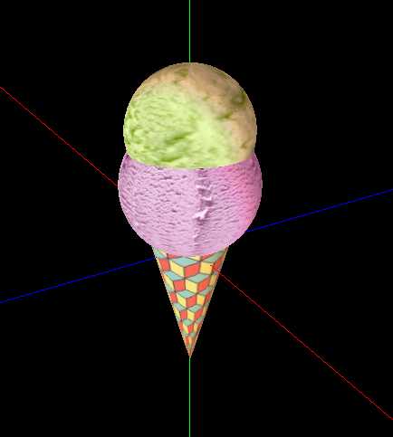
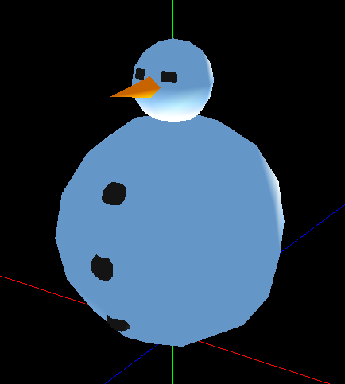

# CG (Computação Gráfica) (Português)
Projeto de grupo desenvolvido no âmbito da Unidade Curricular de Computação Gráfica. Este projeto consistiu na implementação de um  mini motor gráfico 3D baseado numa estrutura de <i>scene graph</i>, e de um gerador que forneça exemplos de utilização para o mesmo.

---
<p>
    
    
</p>

<p>
    
    
</p>

---

### Membros do Grupo
- [Duarte Escairo](https://github.com/darteescar)
- [Luís Soares](https://github.com/luis7788)
- [Tiago Figueiredo](https://github.com/tiagofigueiredo7)
- [Inês Ribeiro](https://github.com/inesferribeiro)

### Ficheiros relevantes
- [Enunciado](./extra_files/enunciado.pdf)
- [Relatório Fase 1](./reports/fase1/relatorio_fase_1.pdf)
- [Relatório Fase 2](./reports/fase2/relatorio_fase_2.pdf)
- [Relatório Fase 3](./reports/fase3/relatorio_fase_3.pdf)
- [Relatório Fase 4](./reports/fase4/relatorio_fase_4.pdf)

#### Demos
- [Demo Fase 2](./tests/others/p2/demo_fase_2.xml)
- [Demo Fase 3](./tests/others/p3/demo_fase_3.xml)
- [Demo Fase 4](./tests/others/p4/demo_fase_4.xml)

#### Outros ficheiros
- **Ficheiros de cena:** [tests/](./tests/) ou em subdiretorias de [tests/](./tests/)
- **Ficheiros de modelos:** [projeto/models/](./projeto/models/)
- **Ficheiros `.patch`:** [projeto/patchs/](./projeto/patchs/)
- **Ficheiros de texturas:** [projeto/texturas/](./projeto/texturas/)
- **Formato de ficheiros de modelos:** [docs/formato.3d](./docs/formato.3d)

> [!WARNING]
> **Dependências:** Para compilar e correr os programas é necessário ter instalado o `CMake`, o `GLUT` e a biblioteca `libtinyxml2-dev`. Para além disso, é necessário ter um compilador C++ instalado (recomenda-se o `g++`).

## Compile

Para compilar o projeto pela primeira vez, basta correr os seguintes comandos no terminal, a partir da diretoria principal do projeto:

```bash
cd projeto/build
cmake .. && make
```

Caso seja feita alguma alteração ao código, basta correr o comando `make` para compilar novamente o projeto (dentro da diretoria `projeto/build`).

## Execute

Para correr o programa `generator`, basta correr o seguinte comando no terminal, a partir da diretoria `projeto/build`:

```bash
./generator <figure> <parameters> <output_file>
```
Este comando é genérico já que é necessário especificar a figura, os parâmetros e o ficheiro de saída. Como exemplo de utilização, o comando abaixo gera um ficheiro `sphere.3d` com uma esfera de raio 1, 10 _slices_ e 10 _stacks_:

```bash
./generator sphere 1 10 10 sphere.3d
```

Para correr o programa `engine`, basta correr o seguinte comando no terminal, a partir da diretoria `projeto/build`:

```bash
./engine <scene_file>
```
Este comando é genérico já que é necessário especificar o ficheiro de cena a ser renderizado. Como exemplo de utilização, o comando abaixo renderiza a cena descrita no ficheiro `sphere.3d`:

```bash
./engine ../../tests/others/p1/sphere.xml
```
> [!NOTE]
> Os ficheiros gerados pelo programa `generator` são guardados diretamente na diretoria `projeto/models/`.
> 
> O `engine` lê os ficheiros `.patch` da diretoria `projeto/patchs/`, as texturas da diretoria `projeto/texturas/` e os ficheiros `.3d` da diretoria `projeto/models/`.
> 
> Não é necessário especificar o caminho completo para os ficheiros de modelos, texturas ou patches, basta especificar o nome do ficheiro (com a extensão). Por exemplo, para usar o modelo `sphere.3d` gerado pelo `generator`, basta especificar `sphere.3d` no ficheiro de cena, e não é necessário especificar o caminho completo `projeto/models/sphere.3d`.
> 
> Para além disso, os ficheiros de cena podem ser guardados em qualquer diretoria, mas é recomendado que sejam guardados na diretoria `tests/` ou em subdiretorias desta.

# CG (Computer Graphics) (English)
Group project developed within the scope of the Computer Graphics course. This project consisted of implementing a mini 3D graphics engine based on a scene graph structure, and a generator that provides usage examples for it.

---
<p>
    
    
</p>

<p>
    
    
</p>

---

### Group Members
- [Duarte Escairo](https://github.com/darteescar)
- [Luís Soares](https://github.com/luis7788)
- [Tiago Figueiredo](https://github.com/tiagofigueiredo7)
- [Inês Ribeiro](https://github.com/inesferribeiro)

### Relevant files
- [Assignment](./extra_files/enunciado.pdf)
- [Phase 1 Report](./reports/fase1/relatorio_fase_1.pdf)
- [Phase 2 Report](./reports/fase2/relatorio_fase_2.pdf)
- [Phase 3 Report](./reports/fase3/relatorio_fase_3.pdf)
- [Phase 4 Report](./reports/fase4/relatorio_fase_4.pdf)

#### Demos
- [Phase 2 Demo](./tests/others/p2/demo_fase_2.xml)
- [Phase 3 Demo](./tests/others/p3/demo_fase_3.xml)
- [Phase 4 Demo](./tests/others/p4/demo_fase_4.xml)

#### Other files
- **Scene files:** [tests/](./tests/) or in subdirectories of [tests/](./tests/)
- **Model files:** [projeto/models/](./projeto/models/)
- **.patch files:** [projeto/patchs/](./projeto/patchs/)
- **Texture files:** [projeto/texturas/](./projeto/texturas/)
- **Model file format:** [docs/formato.3d](./docs/formato.3d)

> [!WARNING]
> **Dependencies:** To compile and run the programs, it is necessary to have `CMake`, `GLUT`, and the `libtinyxml2-dev` library installed. Additionally, a C++ compiler must be installed (it is recommended to use `g++`).

## Compile

To compile the project for the first time, simply run the following commands in the terminal, from the main directory of the project:

```bash
cd projeto/build
cmake .. && make
```

If any changes are made to the code, just run the `make` command to recompile the project (inside the `projeto/build` directory).

## Execute

To run the `generator` program, simply run the following command in the terminal, from the `projeto/build` directory:

```bash
./generator <figure> <parameters> <output_file>
```
This command is generic as it is necessary to specify the figure, parameters, and output file. As an example of use, the command below generates a `sphere.3d` file with a sphere of radius 1, 10 slices, and 10 stacks:

```bash
./generator sphere 1 10 10 sphere.3d
```

To run the `engine` program, simply run the following command in the terminal, from the `projeto/build` directory:

```bash
./engine <scene_file>
```
This command is generic as it is necessary to specify the scene file to be rendered. As an example of use, the command below renders the scene described in the `sphere.3d` file:

```bash
./engine ../../tests/others/p1/sphere.xml
```
> [!NOTE]
> The files generated by the `generator` program are saved directly in the `projeto/models/` directory.
> 
> The `engine` reads `.patch` files from the `projeto/patchs/` directory, textures from the `projeto/texturas/` directory, and `.3d` files from the `projeto/models/` directory.
> 
> It is not necessary to specify the full path for the model, texture, or patch files; just specify the file name (with extension). For example, to use the `sphere.3d` model generated by the `generator`, just specify `sphere.3d` in the scene file, and it is not necessary to specify the full path `projeto/models/sphere.3d`.
> 
> Additionally, scene files can be saved in any directory, but it is recommended that they be saved in the `tests/` directory or its subdirectories.